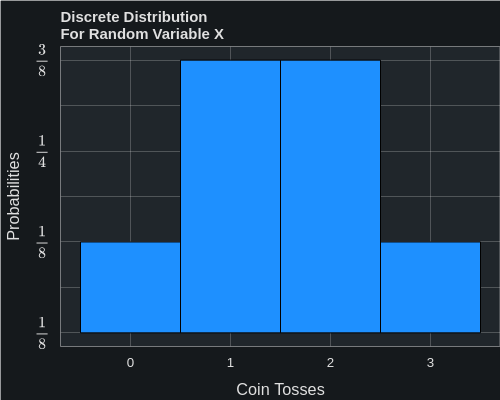

# Probability Distributions
A comprehensive look at probability distributions components, applications in Python

## Introduction
Probability distributions describe how the values of a random variable are distributed. They are fundamental in statistics and are categorized mainly into two types based on the nature of the random variable they describe:

In short a distribution is a the possible values a variable can take and how frequently they occur 
 
<b>Probability Distribution Notations:</b> 

 - x,y, i - regular variables
 - X,Y - random variables
 - $E(X)$ - Expected value of X
 - $Var(X)$ - Variance of X
 

More notations will be introduced as we go along 

### Types of Probability Distributions
1. **Discrete Probability Distributions**: These apply to discrete random variables, which are variables that take on a countable number of distinct values. The distribution of a discrete random variable is described by a Probability Mass Function (PMF), which gives the probability that the random variable takes on a specific value.

2. **Continuous Probability Distributions**: These apply to continuous random variables, which can take on any value within a continuous range. The distribution of a continuous random variable is described by a Probability Density Function (PDF), which, when integrated over a range of values, gives the probability that the random variable falls within that range. The PDF itself does not give probabilities directly but rather the relative likelihood of the random variable being near a particular value.

Both types of distributions can be further characterized by their Cumulative Distribution Function (CDF), which gives the probability that the random variable is less than or equal to a certain value. For discrete random variables, the CDF is the cumulative sum of the PMF up to that value. For continuous random variables, the CDF is the integral of the PDF up to that value, representing the area under the PDF curve from negative infinity to that value.

### Probability Frequency Distributions (Probabilities)
Probability Frequency Distributions more commonly referred to as <b>Probabilities</b> is the measure of the likelihood of an outcome based on how often it is featured in the sample space ($\Omega$). The probability of an event is a number between 0 and 1, where 0 indicates that the event will not occur and 1 indicates that the event will occur. The sum of the probabilities of all possible outcomes in the sample space is equal to 1.

The Frequency Distribution Table below details the roll of 2 dice. The Sum column is the sum of the roll of the two dice from 2 ( 1 + 1) to 12 (6 + 6) with the highest frequency being the sum of 7. There are 6 different ways to roll a 7 resulting in a probability of $\dfrac{1}{6}$. Each probability is equal to the Frequency divided by the Sample Space $\Omega$. For example the frequency for 7 is 6, resulting in $\dfrac{6}{36}$ or $\dfrac{1}{6}$. 
 
This is is the typical way to construct probabilities when we have a <b>Finite</b> amount of elements. 
 
<b>Frequency Distribution Table for the Sum of Rolling Two Dice:</b> 

|  Sum  |  Frequency  |   Probability   |
|:-----:|:-----------:|:---------------:|
|   2   |      1      | $\dfrac{1}{36}$ |
|   3   |      2      | $\dfrac{1}{18}$ |
|   4   |      3      | $\dfrac{1}{12}$ |
|   5   |      4      | $\dfrac{1}{9}$  |
|   6   |      5      | $\dfrac{5}{36}$ |
|   7   |      6      | $\dfrac{1}{6}$  |
|   8   |      5      | $\dfrac{5}{36}$ |
|   9   |      4      | $\dfrac{1}{9}$  |
|  10   |      3      | $\dfrac{1}{12}$ |
|  11   |      2      | $\dfrac{1}{18}$ |
|  12   |      1      | $\dfrac{1}{36}$ | 

 

<b>Distribution Example </b> 
It helps me to start with an example when I am trying to grasp something that is not initially clear to me. So that is what I will do here with a Distribution 
Lets start with the random variable X, which will represent 3 coins tosses of a fair coin. The possible outcomes of the three tosses are: 
 
<b>H = heads 
T = tails </b>

* HHH
* HHT
* HTH
* THH
* TTH
* THT
* HTT
* TTT

<b>The 8 trials represent make up the Random Variable X</b> 

<b>The Possible Outcomes Of X:</b> 
There are FOUR possible values for X: 

* you can flip THREE times and get ZERO Heads (TTT)
* you can flip THREE times and get ONE Heads (TTH, THT, HTT)
* you can flip THREE times and get TWO Heads (HTT, HTH, THH)
* you can flip THREE times and get THREE Heads (HHH)

<b>The Probabilities of the Possible Outcomes Of X:</b> 

* Probability of getting 0 Heads (TTT): $P(X = 0) = \dfrac{1}{8} = 0.125$
* Probability of getting 1 Heads (TTH, THT, HTT): $P(X = 3) = \dfrac{3}{8} = 0.3755$
* Probability of getting 2 Heads (HTT, HTH, THH): $P(X = 3) = \dfrac{3}{8} = 0.375$
* Probability of getting 3 Heads (HHH): $P(X = 3) = \dfrac{1}{8} = 0.125$
 
<b>Show The Distribution Of X</b> 

